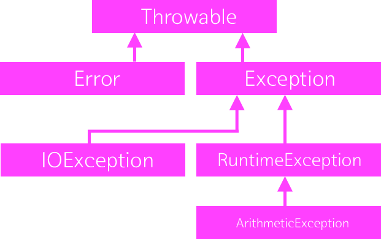
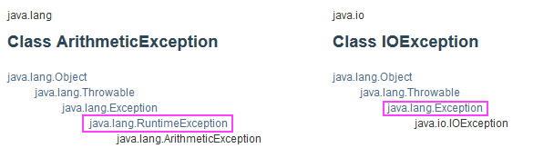

### 예외

| 예외 종류                 | 상황                                        |
| ------------------------- | ------------------------------------------- |
| IllegalArgumentException  | 매개변수가 의도하지 않은 상황을 유발시킬 때 |
| IllegalStateException     | 메소드를 호출하기 위한 상태가 아닐 때       |
| NullPointerException      | 매개 변수 값이 null 일 때                   |
| IndexOutOfBoundsException | 인덱스 매개 변수 값이 범위를 벗어날 때      |
| ArithmeticException       | 산술적인 연산에 오류가 있을 때              |

### 예외 목록

 

- checked 예외 
  - RuntimeException을 제외한 Exception의 하위 클래스 
- unchekced 예외 
  - RuntimeException의 하위 클래스 => 예외 처리 필수 ((ex)IOException)

---

### error: JavaFX 응용 프로그램 클래스는 javafx.application.Application을(를) 확장해야 합니다.

이유는 단순히 저장을 안해서 그런거였다.
 
저장(Ctrl+S)을 하고 다시 누르니 실행이 된다. 기록!
